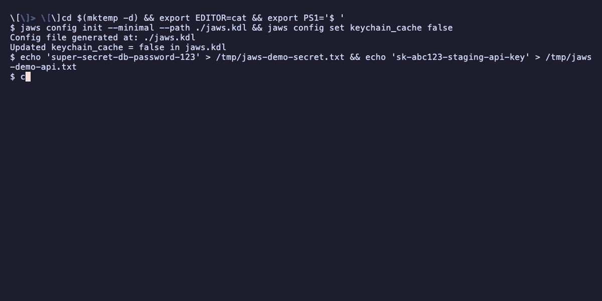

# JAWS

Just A Working Secretsmanager

A CLI tool and library for managing secrets from multiple providers (AWS Secrets Manager, GCP Secret Manager, 1Password, Bitwarden, and local storage) with local version tracking and secure remote secret sharing.



## Features

- **Multi-provider support** - AWS Secrets Manager, GCP Secret Manager, 1Password, Bitwarden, and local "jaws" secrets
- **Remote secret sharing** - Share secrets across machines with `jaws serve` and `jaws connect` (gRPC + mTLS)
- **Git-like workflow** - `jaws pull`, `jaws push`, familiar commands
- **Local version tracking** - Full history of downloaded secrets with rollback support
- **Template injection** - Inject secrets into config files with `--inject`
- **Script-friendly** - Print secrets to stdout with `--print` for shell scripts
- **Encrypted export/import** - Archive secrets with passphrase or SSH key encryption
- **Credential storage** - Encrypt and store provider tokens locally with passphrase or SSH key, cached in the OS keychain
- **TUI picker** - Interactive fuzzy finder for secret selection
- **Library support** - Use as a Rust library in your own projects

## Installation

### Using Cargo

```bash
cargo install --path .
```

### Using Nix

```bash
# Build and run directly
nix run github:jacbart/jaws

# Install to profile
nix profile install github:jacbart/jaws

# Or add to your flake inputs
{
  inputs.jaws.url = "github:jacbart/jaws";
}
```

### Cross-Compiled Binaries

Pre-built binaries for multiple platforms can be built using the Nix flake:

```bash
# Build for specific target
nix build .#jaws-x86_64-linux      # Intel/AMD Linux
nix build .#jaws-aarch64-linux     # ARM64 Linux (AWS Graviton, etc.)
nix build .#jaws-x86_64-darwin     # Intel Mac
nix build .#jaws-aarch64-darwin    # Apple Silicon Mac

# Build native (optimal for current platform)
nix build .#default
```

## Quick Start

```bash
# Generate a config file (interactive mode discovers providers)
jaws config init

# Or generate a minimal template without prompts
jaws config init --minimal

# Pull secrets from your providers (opens TUI picker)
jaws pull

# Pull a specific secret
jaws pull aws://my-secret
jaws pull gcp://my-secret

# Edit and push changes back
jaws push

# View operation log
jaws log

# View version history for a specific secret
jaws log my-secret

# Rollback to a previous version
jaws rollback
```

## Commands

### Secret Operations

| Command                   | Description                                    |
| ------------------------- | ---------------------------------------------- |
| `jaws`                    | Open TUI to select and edit downloaded secrets |
| `jaws pull [SECRET]`      | Download secrets from providers                |
| `jaws pull -p SECRET`     | Print secret value to stdout (for scripts)     |
| `jaws pull -i TPL -o OUT` | Inject secrets into a template file            |
| `jaws push`               | Upload changed secrets to providers            |
| `jaws create [NAME]`      | Create a new secret (local or remote)          |
| `jaws delete [SECRET]`    | Delete a secret (prompts for scope)            |
| `jaws delete -s remote`   | Delete a secret from the remote provider only  |
| `jaws list`               | List all known secrets (one per line)          |
| `jaws sync`               | Refresh local cache of remote secrets          |

### Remote Secret Sharing

| Command                              | Description                                              |
| ------------------------------------ | -------------------------------------------------------- |
| `jaws serve`                         | Start the gRPC secret sharing server (mTLS)              |
| `jaws serve -n NAME`                 | Start server with a custom name                          |
| `jaws serve -b ADDR`                 | Bind to a specific address (default: `0.0.0.0:9643`)    |
| `jaws serve --generate-token`        | Generate a new enrollment token (no server restart)      |
| `jaws serve --list-clients`          | List enrolled clients and their status                   |
| `jaws serve --revoke CLIENT`         | Revoke a client's access                                 |
| `jaws connect URL --token TOKEN`     | Enroll with a remote jaws server                         |
| `jaws connect URL -n NAME`           | Connect with a custom server name                        |
| `jaws disconnect NAME`               | Remove a server connection and delete client certificates|

### Log & Rollback

| Command                  | Description                                    |
| ------------------------ | ---------------------------------------------- |
| `jaws log`               | Show global operation log                      |
| `jaws log <SECRET>`      | Show version history for a specific secret     |
| `jaws log -v <SECRET>`   | Verbose version history (hashes, filenames)    |
| `jaws log -p <PROVIDER>` | Filter operation log by provider               |
| `jaws rollback`          | Rollback to a previous local version           |
| `jaws rollback --remote` | Rollback to a previous version on the provider |

### Archive Operations

| Command            | Description                                    |
| ------------------ | ---------------------------------------------- |
| `jaws export`      | Export and encrypt secrets to a `.barrel` file |
| `jaws import FILE` | Import and decrypt a `.barrel` archive         |

### Maintenance

| Command                         | Description                                       |
| ------------------------------- | ------------------------------------------------- |
| `jaws clean`                    | Clear local cache and secrets                     |
| `jaws version`                  | Print version information                         |

### Configuration

| Command                           | Description                                       |
| --------------------------------- | ------------------------------------------------- |
| `jaws config`                     | Show current configuration and providers          |
| `jaws config init`                | Interactive config generation with auto-discovery |
| `jaws config init --minimal`      | Generate a minimal config template                |
| `jaws config get <key>`           | Get a specific config value                       |
| `jaws config set <key> <value>`   | Set a config value                                |
| `jaws config provider`            | List configured providers                         |
| `jaws config provider add`        | Add a provider (interactive discovery)            |
| `jaws config provider add -k TYPE`| Add a specific provider type (aws, gcp, onepassword, bitwarden) |
| `jaws config provider remove`     | Remove a provider (interactive picker)            |
| `jaws config provider remove <id>`| Remove a provider by ID                           |
| `jaws config clear-cache`         | Clear cached credentials from the OS keychain     |

## Configuration

JAWS uses a `jaws.kdl` config file ([KDL](https://kdl.dev/) format):

```kdl
// jaws configuration file
// cache_ttl is in seconds (default: 900 = 15 minutes)

defaults editor="nvim" secrets_path="./.secrets" cache_ttl=900 default_provider="jaws"

// AWS with auto-discovery of all profiles
provider "aws" kind="aws" {
    profile "all"
}

// Or a specific AWS profile
provider "aws-prod" kind="aws" {
    profile "production"
    region "us-east-1"
}

// 1Password with auto-discovery of all vaults
provider "op" kind="onepassword" {
    vault "all"
}

// Or a specific 1Password vault
provider "op-dev" kind="onepassword" {
    vault "abc123"
}

// Bitwarden Secrets Manager
provider "bw-myproject" kind="bw" {
    vault "project-uuid-here"
    organization "org-uuid-here"
    token-env "BWS_ACCESS_TOKEN"
}

// GCP Secret Manager
provider "gcp-prod" kind="gcp" {
    project "my-gcp-project-id"
}

// Remote server connections (added by `jaws connect`)
server "myserver" url="https://10.0.0.5:9643" {
    ca-cert "~/.config/jaws/clients/myserver/ca.pem"
    client-cert "~/.config/jaws/clients/myserver/client.pem"
    client-key "~/.config/jaws/clients/myserver/client-key.pem"
}
```

### AWS Setup

Ensure your AWS credentials are configured in `~/.aws/credentials` and you have appropriate IAM permissions for Secrets Manager.

### 1Password Setup

Set the `OP_SERVICE_ACCOUNT_TOKEN` environment variable with your 1Password service account token.

### Bitwarden Setup

Set the `BWS_ACCESS_TOKEN` environment variable with your Bitwarden Secrets Manager access token.

### GCP Setup

Authenticate using [Application Default Credentials](https://cloud.google.com/docs/authentication/application-default-credentials):

```bash
# For local development
gcloud auth application-default login

# Or use a service account key
export GOOGLE_APPLICATION_CREDENTIALS="/path/to/service-account-key.json"
```

The `project` field in the provider config specifies which GCP project to use. The project ID can also be auto-discovered during `jaws config init` from the `GOOGLE_CLOUD_PROJECT` environment variable or the active `gcloud` configuration.

## Remote Secret Sharing

JAWS includes a built-in gRPC server with mTLS (mutual TLS) authentication for securely sharing secrets across machines. The server exposes all configured providers to enrolled clients.

### How It Works

```
┌──────────────────┐        mTLS (gRPC/HTTP2)        ┌──────────────────┐
│   jaws client    │ ◄──────────────────────────────► │   jaws serve     │
│                  │                                   │                  │
│ RemoteProvider   │  ── pull/push/list/create/del ─► │ SecretManager    │
│ (per server      │                                   │ providers[]      │
│  provider)       │                                   │ (aws, gcp, op…)  │
└──────────────────┘                                   └──────────────────┘
```

- The **server** runs `jaws serve` and exposes its configured providers over gRPC
- **Clients** enroll via `jaws connect` using a one-time enrollment token
- After enrollment, remote providers appear transparently as `servername/provider` (e.g., `myserver/aws-prod`)
- All operations (pull, push, create, delete, rollback) work through remote providers using the same syntax

### Security

- **mTLS authentication** - Both server and client present certificates signed by the server's CA
- **Built-in PKI** - Certificate Authority generated automatically on first `jaws serve` run (no external PKI required)
- **One-time enrollment tokens** - UUID tokens expire in 15 minutes, single-use
- **Certificate pinning** - Clients trust only the specific server CA
- **Client revocation** - `jaws serve --revoke <name>` immediately blocks a client
- **Audit logging** - All remote operations logged with client identity
- **No secret caching** - Secrets are fetched from providers on-demand per request

### Server Setup

```bash
# Start the server (generates CA and certs on first run)
jaws serve -n myserver

# The server prints an enrollment token:
#   === Enrollment Token ===
#     a1b2c3d4-e5f6-7890-abcd-ef1234567890
#   ========================

# Generate additional tokens without restarting
jaws serve --generate-token

# Manage enrolled clients
jaws serve --list-clients
jaws serve --revoke badclient
```

### Client Setup

```bash
# Enroll with the server (saves certs + updates config automatically)
jaws connect https://10.0.0.5:9643 --token a1b2c3d4-e5f6-7890-abcd-ef1234567890

# Discover remote secrets
jaws sync

# Pull a secret through the server
jaws pull myserver/aws-prod://db-password -p

# Use in templates
jaws pull -i .env.tpl -o .env
# where .env.tpl contains: DB_PASS={{myserver/aws-prod://db-password}}

# Disconnect when done
jaws disconnect myserver
```

### Custom Certificates

By default, `jaws serve` generates its own CA and certificates. You can also provide your own:

```bash
jaws serve \
  --ca-cert /path/to/ca.pem \
  --ca-key /path/to/ca-key.pem \
  --server-cert /path/to/server.pem \
  --server-key /path/to/server-key.pem
```

## Usage Examples

### Scripting with `--print`

```bash
# Get a secret value for use in scripts
export DB_PASSWORD=$(jaws pull aws://prod/db-password -p)

# Use in a command
mysql -u admin -p$(jaws pull aws://mysql-pass -p) mydb

# Pull from a remote server
export API_KEY=$(jaws pull myserver/aws-prod://api-key -p)
```

### Template Injection with `--inject`

Create a template file (e.g., `.env.tpl`):

```
DATABASE_URL=postgres://user:{{aws://db-password}}@localhost/mydb
API_KEY={{gcp://api-key}}
FALLBACK_KEY={{jaws://api-key || 'default_value' }}
REMOTE_SECRET={{myserver/op-team://shared-token}}
```

Inject secrets:

```bash
# Output to stdout
jaws pull -i .env.tpl

# Output to file
jaws pull -i .env.tpl -o .env.prod
```

### Creating Secrets

You can create secrets locally or directly in a remote provider:

```bash
# Create a local secret (default provider)
jaws create my-local-secret

# Create a secret in AWS or GCP
jaws create aws://my-new-secret
jaws create gcp://my-new-secret

# Create from a file
jaws create my-cert -f ./certificate.pem
```

### Local Management

List and manage secrets:

```bash
# List all secrets including local ones
jaws list --provider jaws

# List secrets from a remote server's provider
jaws list --provider myserver/aws-prod
```

### Clean Up

```bash
# See what would be deleted
jaws clean --dry-run

# Delete remote caches but keep local jaws secrets
jaws clean --keep-local

# Full cleanup (with confirmation for local secrets)
jaws clean
```

## Export/Import

Securely archive your secrets directory:

```bash
# Export with passphrase
jaws export

# Export with SSH public key
jaws export -K ~/.ssh/id_ed25519.pub

# Export to specific file
jaws export -o backup.barrel

# Import with passphrase
jaws import ./jaws.barrel

# Import with SSH private key
jaws import ./jaws.barrel -K ~/.ssh/id_ed25519
```

## Library Usage

JAWS can be used as a Rust library:

```rust
use jaws::{Config, detect_providers};

#[tokio::main]
async fn main() -> Result<(), Box<dyn std::error::Error>> {
    let config = Config::load()?;
    let providers = detect_providers(&config, None).await?;

    for provider in &providers {
        println!("Provider: {} ({})", provider.id(), provider.kind());
    }

    Ok(())
}
```

## Project Structure

```
src/
├── main.rs          # CLI entry point
├── lib.rs           # Library exports
├── archive.rs       # Encryption/archiving (age-based)
├── credentials.rs   # Credential encryption, decryption, and session caching
├── keychain.rs      # OS keychain integration (TTL-based cache)
├── cli/             # CLI argument and command definitions
├── client/          # Remote client (RemoteProvider, mTLS connection, enrollment)
├── commands/        # Command handlers
├── config/          # Configuration loading, types, and provider discovery
├── db/              # SQLite database (schema, models, repository)
├── secrets/         # Secret providers
│   └── providers/   # AWS, GCP, 1Password, Bitwarden, local
├── server/          # gRPC server (mTLS, PKI, enrollment, service)
└── utils/           # Utilities
proto/
└── jaws.proto       # gRPC service definition
```

## Development

### Dev Shell

Enter the development environment with all dependencies:

```bash
nix develop
```

### Building from Source

```bash
# Native build
cargo build --release

# Or using Nix
nix build
```

### Demo GIF

Regenerate the demo GIF (requires the nix dev shell for `vhs`, `ttyd`, and `ffmpeg`):

```bash
./scripts/demo.sh
```

The tape file at `scripts/demo.tape` defines the recorded session. Edit it to change what the demo shows.

### Cross-Compilation

The project supports cross-compilation using `cargo-zigbuild` for Linux targets and native cargo for Darwin targets:

```bash
# Build all cross-compiled binaries
./scripts/release.sh --build-only

# Full release process (updates version, builds all targets, creates tag)
./scripts/release.sh 1.3.0
```

Release binaries are output to `dist/`:

```
dist/
├── jaws-x86_64-linux.tar.gz
├── jaws-aarch64-linux.tar.gz
├── jaws-x86_64-darwin.tar.gz
└── jaws-aarch64-darwin.tar.gz
```

## License

MPL 2.0
